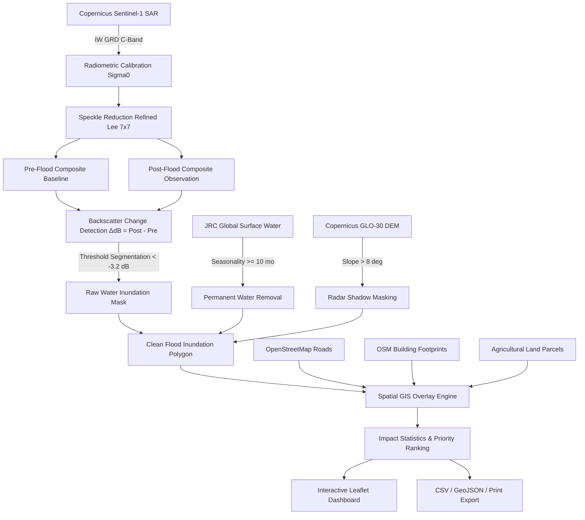

# RapidFlood: Rapid Flood Mapping and Impact Assessment Using Sentinel-1 SAR

[](LICENSE)
[](https://reactjs.org/)
[](https://www.typescriptlang.org/)
[](https://vitejs.dev/)
[](https://tailwindcss.com/)
[](https://sentinels.copernicus.eu/)

> An automated satellite-based decision-support platform designed for rapid flood detection and infrastructure impact assessment using Sentinel-1 Synthetic Aperture Radar (SAR) backscatter change analysis and OpenStreetMap GIS spatial overlays.

---

## 1. Problem Statement

> **"Develop an automated satellite-based system for rapid flood detection and impact assessment using Sentinel-1 SAR imagery by comparing pre-flood and post-flood conditions, identifying newly inundated areas, and determining the affected settlements, roads, and agricultural land."**

---

## 2. Introduction

Floods are among the most frequent and damaging natural disasters worldwide, causing severe loss of life, infrastructure damage, transport disruptions, and destruction of agricultural land. Traditional ground surveys are often hazardous and slow, while optical satellites are severely limited by cloud cover and heavy rainfall during monsoon or storm events.

**RapidFlood** solves this bottleneck by leveraging Copernicus **Sentinel-1 C-band Synthetic Aperture Radar (SAR)**. Radar microwaves (5.405 GHz) effortlessly penetrate clouds, rainstorms, and nighttime conditions. By measuring the dramatic drop in radar backscatter ($ \Delta \text{dB} $) caused by specular surface reflection on smooth floodwaters, the platform automatically generates high-resolution inundation masks and calculates spatial impact across roads, buildings, and croplands.

---

## 3. Primary Objectives

1. **All-Weather Satellite Detection:** Ingest multi-temporal Sentinel-1 SAR GRD imagery to detect flood extents regardless of cloud cover.
2. **Backscatter Log-Ratio Change Detection:** Calculate $\Delta \text{dB} = \text{Post} - \text{Pre}$ to isolate newly submerged surfaces from dry land.
3. **Permanent Water & Slope Masking:** Eliminate historical water bodies using the JRC Global Surface Water seasonality baseline and suppress terrain radar shadow false positives via Copernicus GLO-30 DEM.
4. **Spatial GIS Impact Overlay:** Intersect flood extent with OpenStreetMap (OSM) vector data to identify severed evacuation highways, flooded building clusters, and submerged agricultural acreage.
5. **Decision Support & Priority Zones:** Classify disaster zones into High, Medium, and Low Priority sectors to optimize emergency search-and-rescue and resource allocation.

---

## 4. System Architecture



---

## 5. Core Processing Methodology

```
Sentinel-1 SAR
      ↓
Pre-Flood Image + Post-Flood Image
      ↓
SAR Processing (Radiometric Calibration & Refined Lee Filter)
      ↓
Backscatter Change Detection (ΔdB Drop)
      ↓
Initial Water Mask
      ↓
Permanent Water Removal (JRC Global Surface Water)
      ↓
Flood Inundation Map
      ↓
GIS Overlay Analysis
  ├── Affected Roads (Cut Evacuation Corridors)
  ├── Affected Settlements (Clusters & Critical Facilities)
  └── Affected Agriculture (Cropland Hectares)
      ↓
Impact Statistics & Charts
      ↓
Interactive Dashboard
      ↓
Priority Decision Support Areas
```

### Physical Principles of SAR Water Detection
* **Dry Soil / Rough Land:** Produces diffuse backscatter (typical $\sigma^0$ ranges between $-8\text{ dB}$ to $-14\text{ dB}$).
* **Smooth Standing Floodwater:** Acts as a specular mirror, reflecting microwave pulses away from the radar antenna ($\sigma^0$ drops sharply to $<-20\text{ dB}$).
* **Change Index:** $\Delta \sigma^0 = \sigma^0_{\text{post}} - \sigma^0_{\text{pre}}$. A negative difference exceeding $-3.2\text{ dB}$ indicates newly flooded land.

---

## 6. Key Features

* **Interactive Multi-Layer Leaflet Map:**
  * Base maps: Dark Matter, Satellite Imagery, OpenStreetMap.
  * Granular layer toggles: Flood Inundation Mask, Permanent Water (JRC), OSM Roads, Settlements/Civic Sites, Agricultural parcels, Priority Zones, and Synthetic Pre/Post SAR layers.
  * Real-time flood opacity slider (10% to 100%).
  * **Split-Screen Before/After Comparison Slider:** Compare pre-flood baseline vs post-flood inundation side by side.
* **Full-Featured Flood Analysis Studio:**
  * Area of Interest (AOI) switcher with 3 predefined global flood events.
  * Temporal reference date pickers (Pre-flood reference vs Post-flood observation).
  * Interactive SAR change threshold slider ($-6.0\text{ dB}$ to $-1.5\text{ dB}$) with live sensitivity feedback.
  * Polarization selector (VV, VH, VV+VH).
  * Speckle filtration selection (Refined Lee, Frost, Gamma MAP).
  * Auxiliary filter toggles (JRC permanent water masking, Copernicus DEM slope masking).
  * **Animated 9-Step Pipeline Execution Modal:** Real-time progress bar, step status indicators, and live telemetry log output.
* **Comprehensive Multi-Sectoral Impact Assessment:**
  * **Roads:** Submerged highway lengths, passable vs blocked segments, severed evacuation corridors.
  * **Settlements:** Inundated structure counts, water depth estimations, flooded hospitals, schools, and emergency shelters.
  * **Agriculture:** Inundated hectares, crop growth stages, and harvest loss risk ratings.
  * **Decision Support Priority Matrix:** Transparent ranking formula ($0.35 \times \text{Area} + 0.35 \times \text{Buildings} + 0.20 \times \text{Roads} + 0.10 \times \text{Agri}$) with actionable emergency directives.
* **Rich Quantitative Analytics:**
  * Sectoral inundation bar charts.
  * Land cover classification pie charts.
  * SAR radar backscatter profile curves ($\text{dB}$ shift).
  * Cropland impact breakdowns.
* **One-Click Export Capabilities:**
  * **CSV:** Tabular impact summary with metadata and indicators.
  * **GeoJSON:** Complete GIS vector package ready for QGIS, ArcGIS, or Mapbox.
  * **Printable Briefing:** Print or save as PDF.
* **Official Google Earth Engine Code Export:**
  * JavaScript and Python Earth Engine scripts included directly in the application with one-click copy.

---

## 7. Predefined Demonstration Locations

The application includes 3 realistic pre-processed demonstration datasets representing major historical flood crises:

1. **Sylhet & Sunamganj Basin (Bangladesh):**
   * *Event:* Historic June 2022 Monsoonal Flash Floods.
   * *Impact:* $234.8\text{ km}^2$ flooded area, $4,820$ structures affected, $142.6\text{ km}$ roads cut off, $98.4\text{ km}^2$ cropland inundated.
2. **Valencia & Turia Basin (Spain):**
   * *Event:* Catastrophic October 2024 DANA Flash Flood.
   * *Impact:* $68.4\text{ km}^2$ flooded area, $2,140$ structures affected, $42.8\text{ km}$ roads severed (A-3, V-31), $28.5\text{ km}^2$ citrus groves inundated.
3. **Patna & Ganga Floodplain (India):**
   * *Event:* August 2023 Gangetic Floodplain Surge.
   * *Impact:* $182.2\text{ km}^2$ flooded area, $3,410$ structures affected, $54.6\text{ km}$ roads submerged, $126.8\text{ km}^2$ diara cropland flooded.

---

## 8. Technology Stack

* **Frontend Framework:** React 18 with TypeScript
* **Build Tool:** Vite 8
* **Styling & Design System:** Tailwind CSS 3 (Dark Geospatial Theme)
* **Icons:** Lucide React
* **Mapping Engine:** Leaflet 1.9 with CartoDB Dark Matter, Esri World Imagery, and OpenStreetMap tiles
* **Data Visualization:** Recharts
* **Geospatial Formats:** GeoJSON (RFC 7946), WGS84 (EPSG:4326)
* **Cloud Earth Engine:** Google Earth Engine JavaScript and Python API bindings

---

## 9. Authoritative Data Sources

| Dataset | Provider | Purpose | Resolution |
| :--- | :--- | :--- | :--- |
| **Sentinel-1 C-SAR** | ESA / Copernicus | All-weather flood detection using backscatter drop | 10m GRD |
| **OpenStreetMap (OSM)** | OSM Community | Roads, building footprints, civic facilities | Vector |
| **Global Surface Water** | EC Joint Research Centre | Seasonality filter for permanent water bodies | 30m |
| **Copernicus DEM** | ESA (GLO-30) | Slope masking to avoid mountain radar shadows | 30m |
| **CartoDB / Esri** | Carto / Esri | High-contrast dark basemaps & satellite imagery | Global Tiles |

---

## 10. Installation & Local Setup

### Prerequisites
* **Node.js:** v18.0.0 or higher (v22+ recommended)
* **npm:** v9.0.0 or higher

### Steps

1. **Clone the repository:**
   ```bash
   git clone https://github.com/your-username/RapidFlood.git
   cd RapidFlood
   ```

2. **Install dependencies:**
   ```bash
   npm install
   ```

3. **Configure environment variables:**
   ```bash
   cp .env.example .env
   ```

4. **Start the local development server:**
   ```bash
   npm run dev
   ```

5. **Open in your browser:**
   ```
   http://localhost:5173/
   ```

6. **Build for production:**
   ```bash
   npm run build
   ```

---

## 11. Environment Variables

Create a `.env` file in the root directory based on `.env.example`:

```env
PORT=5173
VITE_ENABLE_DEMO_MODE=true
VITE_GEE_PROJECT_ID=
VITE_GEE_API_KEY=
```

---

## 12. Google Earth Engine Setup (Live Execution)

If configuring live Earth Engine processing:
1. Register a Google Cloud project with Google Earth Engine enabled at [earthengine.google.com](https://earthengine.google.com/).
2. Create a Service Account with the `Earth Engine Resource Viewer` role.
3. Generate and download a JSON private key.
4. Set `VITE_GEE_PROJECT_ID` in your `.env`.
5. Run the provided Earth Engine script in the **Google Earth Engine Code Editor** (available in the application under *Flood Analysis → Earth Engine Code*).

*Note: For the 6-hour hackathon, the application defaults to **DEMO MODE**, ensuring instant, zero-latency demonstrations without cloud quota or credential failures.*

---

## 13. Step-by-Step Hackathon Demonstration Script (2–3 Minutes)

* **Step 1 — Introduction (Dashboard):**
  Open the Dashboard (`http://localhost:5173/`). Point out the KPI cards ($234.8\text{ km}^2$ flooded area, $4,820$ structures affected), the workflow banner, and explain:
  *"Our system provides rapid, all-weather satellite-based flood detection and impact assessment using Sentinel-1 SAR."*
* **Step 2 — Configure SAR Analysis (Flood Analysis):**
  Navigate to **Flood Analysis**. Select an Area of Interest (e.g. *Valencia & Turia Basin, Spain*). Show the pre-flood and post-flood dates, the radar backscatter threshold slider ($-3.2\text{ dB}$), and the permanent water filter toggle.
* **Step 3 — Run Analysis Pipeline:**
  Click **"Run Flood Analysis Pipeline"**. Showcase the animated 9-step processing modal as it searches Sentinel-1 granules, applies speckle filtration, computes $\Delta \text{dB}$, removes permanent rivers, and overlays OSM vectors.
* **Step 4 — Interactive Map & Split View:**
  Navigate to **Live Map**. Toggle the *Flood Inundation Mask* and show the transparency slider. Click **"Split View"** and drag the Before/After slider to demonstrate pre-flood baseline vs post-flood inundation. Click on any submerged highway or pink settlement marker to show the detailed popups.
* **Step 5 — Analytics & Charts:**
  Navigate to **Analytics**. Highlight the Recharts visualizations: Flooded Area by Sector, Land Cover Inundation Pie Chart, and the SAR Backscatter Profile Curve demonstrating the specular reflection $\text{dB}$ drop.
* **Step 6 — Impact Assessment & Priority Zones:**
  Navigate to **Impact Assessment**. Show the Submerged Roads table with severed evacuation corridors and the Priority Decision Zones (Sector Alpha High Priority) with actionable response instructions.
* **Step 7 — Export & Project Information:**
  Click **"Export"** in the top header and display the CSV, GeoJSON, and Printable briefing options. Conclude with **Project Information** showcasing the formal problem statement and technical glossary.

---

## 14. Important Accuracy & Ethical Guidelines

* **Decision Support System:** RapidFlood is an automated decision-support tool designed for rapid situational awareness and resource prioritization. It does not replace official civil defense evacuation declarations.
* **Radar Limitations:** SAR backscatter can be influenced by wind-roughened open water (Bragg scattering) or urban corner reflectors. The tool uses calibrated thresholds and DEM slope masks to minimize these artifacts.
* **Population Integrity:** Population estimates are derived from verified structural building counts to avoid fabricating unverified population numbers.

---

## 15. Future Improvements

* Integration of Sentinel-2 multispectral optical imagery for automated cloud-free false-color composite validation (NDWI).
* Machine learning segmentation (U-Net / DeepLabV3+) trained on SAR amplitude and coherence imagery.
* Real-time river discharge gauge telemetry integration (GloFAS / Copernicus Emergency Management Service).
* Automated mobile SMS alerts for localized evacuation corridors.

---

## 16. License

This project is licensed under the MIT License — see the [LICENSE](LICENSE) file for details.
